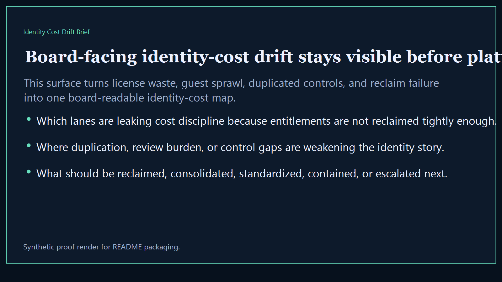
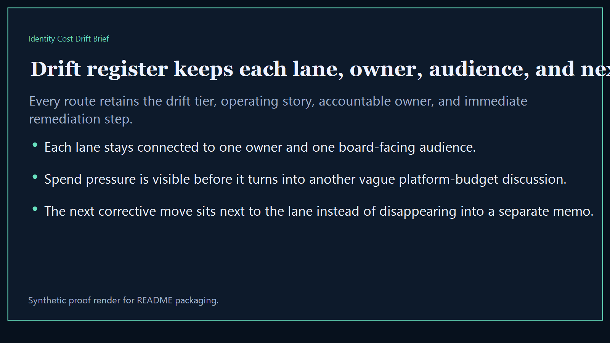
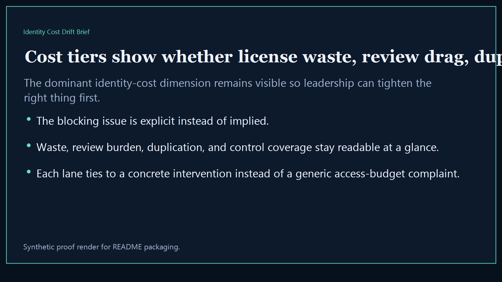
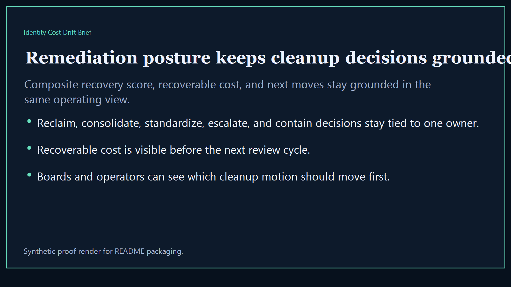

# Identity Cost Drift Brief

Board-ready executive-intelligence surface for exposing identity spend drift, license overlap, control duplication, and operator-visible cost leakage across the broader Kinetic Gain suite.

- Live: `http://idcost.kineticgain.com/`
- Repo: `mizcausevic-dev/identity-cost-drift-brief`

## Why this matters

Leaders need one identity-cost brief that shows where access spend is drifting, where tooling overlap is leaking money, and which control layers deserve intervention before the next board or investor review.

## What it includes

- TypeScript executive-intelligence surface for tracking identity cost drift, control overlap, and leakage pressure
- synthetic lanes across multiple sectors, owner groups, and board-visible access-spend failures
- reusable outputs for drift register, cost tiers, remediation posture, and board-ready identity narratives
- prerendered static site, JSON payloads, screenshots, and docs

## Routes

- `/`
- `/drift-register`
- `/cost-tiers`
- `/remediation-posture`
- `/verification`
- `/docs`

## Local run

```bash
cd identity-cost-drift-brief
npm install
npm run verify
npm run prerender
npm run render:assets
```

## CLI

```bash
npx identity-cost-drift-brief fixtures/identity-cost-drift-brief.json --format summary
npx identity-cost-drift-brief fixtures/identity-cost-drift-brief-clean.json --format json
```

## Docs

- [Architecture](docs/architecture.md)
- [Origin](docs/ORIGIN.md)
- [Kinetic Gain Embedded](docs/KINETIC_GAIN_EMBEDDED.md)

## Screenshots





